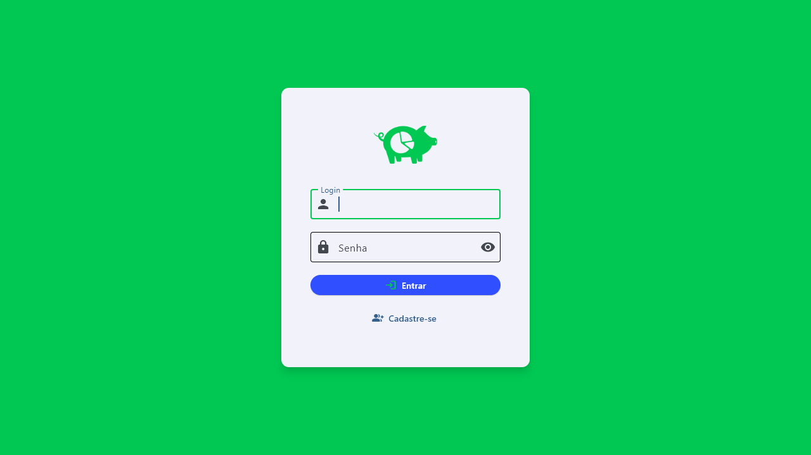
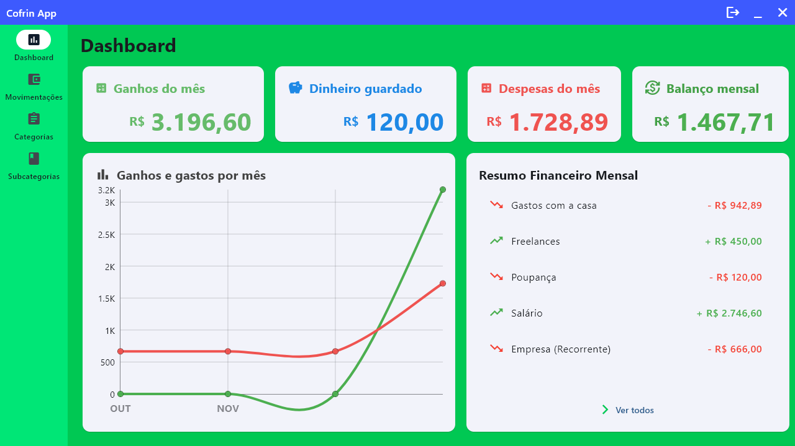
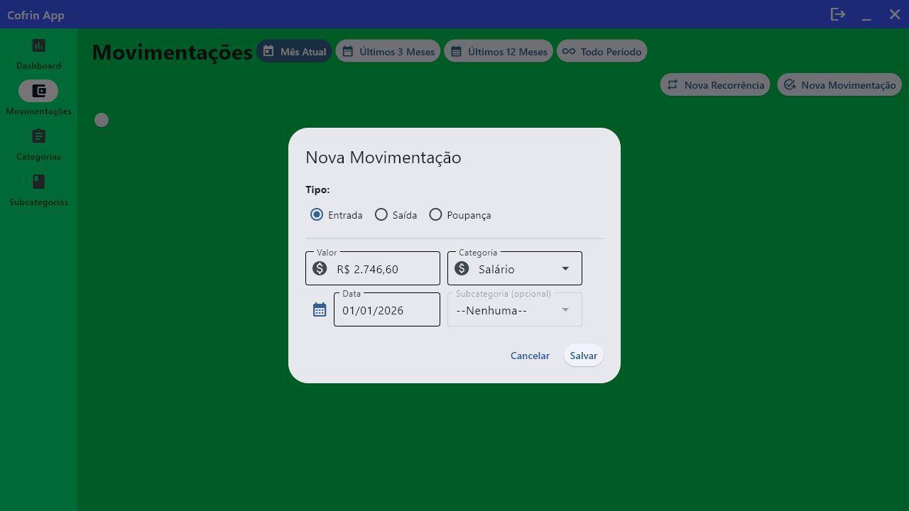
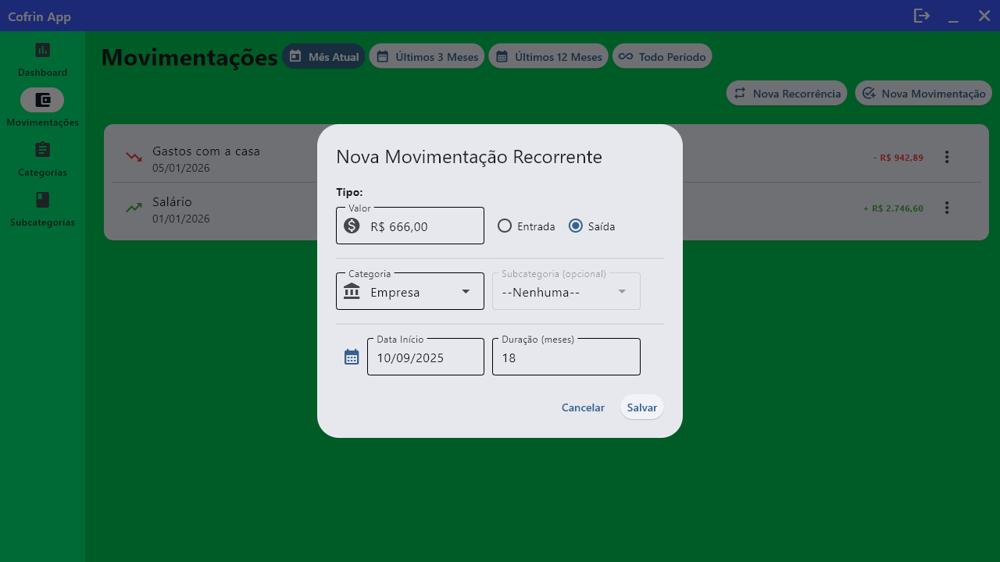

# Cofrin (Flet)

Aplicacao desktop/web de controle financeiro pessoal, construida com Flet. Permite organizar entradas, saidas, poupanca, categorias e subcategorias, alem de acompanhar um dashboard com graficos e resumo mensal.

## Pre-visualizacoes






## Funcionalidades
- Autenticacao com cadastro, login e sessao persistida no `client_storage`.
- Dashboard com cartoes de ganhos, despesas, poupanca e balanco mensal, grafico de 4 meses e resumo das ultimas movimentacoes.
- Movimentacoes com filtros por periodo (mes atual, ultimos 3/12 meses ou todo o historico), paginacao, criacao/edicao/remocao e suporte a poupanca.
- Movimentacoes recorrentes com data inicial, duracao opcional e opcao de desativar.
- Gestao de categorias e subcategorias com icones, cores e paginacao.
- Armazenamento local em SQLite (`storage/data/cofrin_database.db`) criado automaticamente na primeira execucao.

## Requisitos
- Python 3.9+
- [uv](https://github.com/astral-sh/uv) ou [Poetry](https://python-poetry.org/) (opcional, escolha um fluxo)
- Flet 0.28.3 (definido em `pyproject.toml`)

## Executando
### Com uv
```
uv sync
uv run flet run          # desktop
uv run flet run --web    # navegador
```

### Com Poetry
```
poetry install
poetry run flet run          # desktop
poetry run flet run --web    # navegador
```

## Estrutura (resumo)
- `src/main.py`: inicializacao do app, rotas e sessao.
- `src/Views/`: telas de Login, Registro e Dashboard.
- `src/Views/AppViews/`: dashboard, movimentacoes (recorrentes e pontuais), categorias e subcategorias.
- `src/Models/`: modelos de dominio (`Usuario`, `Operacao`, `Recorrencia`, `Categoria`, `SubCategoria`).
- `src/Context/DbContext.py`: criacao e conexao com o SQLite.
- `src/Services/AuthService.py`: autenticacao e persistencia da sessao.
- `storage/data/`: base local (`cofrin_database.db`). Delete este arquivo para resetar dados.

## Build / distribuicao
- Android: `flet build apk -v`
- iOS: `flet build ipa -v`
- macOS: `flet build macos -v`
- Linux: `flet build linux -v`
- Windows: `flet build windows -v`

Consulte a documentacao do Flet para detalhes de assinatura e publicacao.
